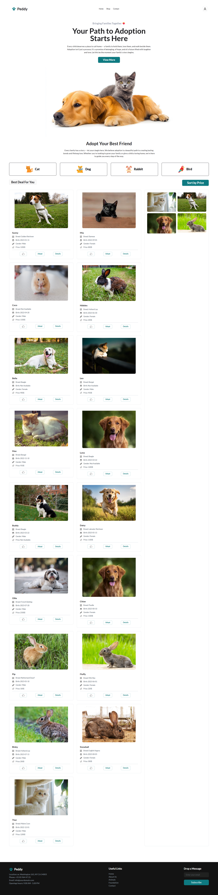

# 🐾 Peddy - Pet Adoption Platform

**Peddy** is a modern, fully responsive pet adoption web platform built with HTML, Tailwind CSS, and JavaScript (ES6). It connects loving families with adorable pets, making the adoption process seamless, intuitive, and joyful.

## 🌐 Live Demo

🔗 [View Live Project](https://your-deployment-link.com)

---

## 📸 Preview

 <!-- Replace with actual screenshot later -->

---

## 🚀 Key Features

1. **Responsive Navbar**

   - Collapsible mobile menu
   - Consistent styling across all devices
   - Designed to match Figma mockup

2. **Interactive Banner Section**

   - Emotionally engaging heading & subtext
   - Smooth scroll to "Adopt Your Best Friend" section
   - Hero image to attract users instantly

3. **Dynamic Pet Listing by Category**

   - Fetches categories and pets from external API
   - Filter pets by category
   - Show meaningful fallback message if data is unavailable
   - Grid layout for pet cards

4. **Adopt Button Logic**

   - 3-second countdown
   - Changes to “Adopted” with visual feedback

5. **Detailed Modal View**

   - Show comprehensive pet info with graceful handling of null values
   - Display with DaisyUI modal

6. **Like Feature**

   - Adds liked pets to a gallery-like sidebar grid
   - Easy visual reference of selected pets

7. **Sort by Price**

   - Sort pets by ascending price
   - Works for entire pet list

8. **Loading Spinner**

   - Shows spinner for minimum 2 seconds during API calls
   - Enhances user experience

9. **Graceful Fallbacks**

   - Handles missing API values like `breed`, `birth date`, or `price` with placeholders

10. **Beautiful Footer**
    - Contact details, subscription form, and useful links
    - Styled for dark theme

---

## ⚙️ Technologies Used

- **HTML5**
- **Tailwind CSS & DaisyUI**
- **JavaScript (ES6+)**
- **External REST API**

---

## ✨ ES6 Features Used

- `const` and `let` variable declarations
- Arrow functions (`=>`)
- Template literals for dynamic HTML
- `async/await` for API calls
- `forEach`, `map`, and `sort` methods
- Optional chaining (`||` fallback for null values)
- DOM manipulation using modern query selectors

---

## 📁 Folder Structure

├── index.html
├── index.js
├── style.css
├── /images
│ └── logo.webp, pet.webp, error.webp

---

## 📱 Responsive Design

Peddy is optimized for:

- **Mobile**: Collapsible menus, single-column layout
- **Tablet**: Adjusted grid and font sizes
- **Desktop**: Full layout with multi-column pet cards and sidebars

All responsiveness handled via **Tailwind CSS breakpoints**.

---

## 🚧 Installation & Usage

To run this project locally:

1. Clone the repository:
   ```bash
   git clone https://github.com/your-username/peddy.git
   cd peddy
   ```
2. Open index.html in your browser.

✅ No build steps or server required — works as a static frontend project!

## 🐕 License
This project is open source